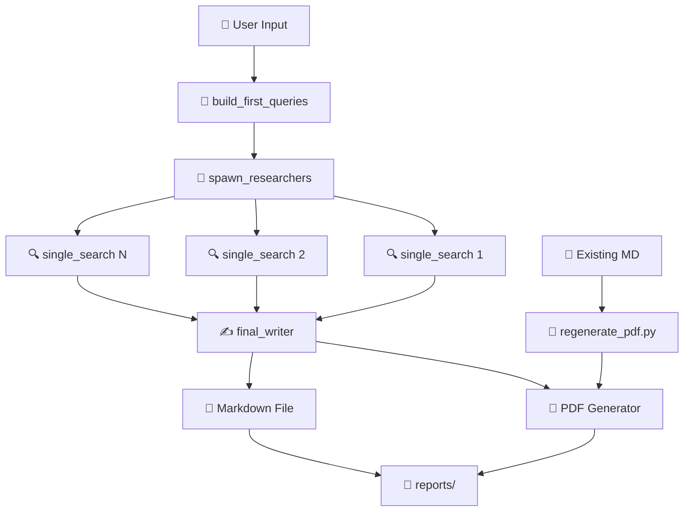

# Agente de Pesquisa e Geração de Relatórios com IA 🤖

Um sistema avançado de IA que automatiza pesquisa web e gera relatórios profissionais em PDF e Markdown, utilizando LangGraph, OpenAI e Tavily para análise inteligente de informações.

## 📖 Descrição

Este projeto implementa um **sistema completo de pesquisa e geração de relatórios** alimentado por IA. O sistema:

1. 🧠 **Analisa perguntas** e gera queries de pesquisa inteligentes
2. 🔍 **Pesquisa paralela** na web usando a API Tavily
3. ⚙️ **Processa e sintetiza** informações de múltiplas fontes
4. 📄 **Gera relatórios profissionais** em PDF e Markdown
5. 📝 **Nomenclatura inteligente** baseada no assunto da pesquisa
6. 🔄 **Regeneração de PDFs** a partir de arquivos Markdown editados

## 🏗️ Arquitetura

O projeto utiliza **LangGraph** para criar um fluxo de trabalho em grafo com os seguintes nós:

```
┌─────────────────────┐    ┌──────────────────────┐    ┌─────────────────────┐
│  build_first_queries │───▶│   spawn_researchers   │───▶│   single_search     │
│                     │    │                      │    │   (paralelo)        │
└─────────────────────┘    └──────────────────────┘    └─────────────────────┘
                                                                    │
                                                                    ▼
                                                        ┌─────────────────────┐
                                                        │   final_writer      │
                                                        │                     │
                                                        └─────────────────────┘
```

### Componentes Principais

- **LLMs**: GPT-4o-mini e o3-mini (OpenAI)
- **Pesquisa Web**: Tavily API
- **Orquestração**: LangGraph
- **Estados**: Pydantic BaseModel
- **Visualização**: Matplotlib para o grafo

## 🚀 Funcionalidades

### 🎯 **Core Features**

- ✅ **Geração automática** de queries de pesquisa inteligentes
- ✅ **Pesquisa paralela** na web com múltiplas queries simultâneas
- ✅ **Extração e síntese** de conteúdo com LLMs avançados
- ✅ **Relatórios profissionais** em PDF e Markdown
- ✅ **Referências automáticas** com links organizados
- ✅ **Logging detalhado** para acompanhamento do processo

### 📊 **Geração de Relatórios**

- 📄 **PDFs profissionais** com formatação e CSS otimizado
- 📝 **Arquivos Markdown** para edição e versionamento
- 🏷️ **Nomenclatura inteligente** baseada no assunto da pesquisa
- ⏰ **Timestamps únicos** para organização cronológica
- 🎨 **Formatação responsiva** com suporte a tabelas e listas

### 🔄 **Edição e Regeneração**

- ✏️ **Edição manual** de arquivos Markdown gerados
- 🔄 **Regeneração de PDFs** sem refazer a pesquisa web
- 🎯 **Múltiplas versões** do mesmo relatório
- 📁 **Gestão automática** de diretórios e arquivos

### 🛠️ **Recursos Avançados**

- 🔍 **Visualização do grafo** de estados com Matplotlib
- 📊 **Estatísticas detalhadas** sobre o processo de geração
- 🌐 **Suporte a caracteres especiais** e acentos portugueses
- 🔒 **Tratamento robusto** de erros e exceções

## 🛠️ Instalação

### Pré-requisitos

- Python >= 3.12
- Conta OpenAI (para API keys)
- Conta Tavily (para pesquisa web)

### Setup

1. **Clone o repositório**

```bash
git clone <url-do-repositorio>
cd ai-agent-perpexity
```

2. **Instale as dependências**

```bash
# Usando uv (recomendado)
uv sync

# Ou usando pip
pip install -r requirements.txt
```

3. **Configure as variáveis de ambiente**

Crie um arquivo `.env` na raiz do projeto:

```env
OPENAI_API_KEY=sua_chave_openai_aqui
TAVILY_API_KEY=sua_chave_tavily_aqui
```

## 📊 Como Usar

### 🚀 **Geração de Relatórios**

```bash
# Executar o sistema principal
uv run graph.py
```

**Fluxo interativo:**

1. Sistema solicita o tópico de pesquisa
2. Geração automática de queries inteligentes
3. Pesquisa paralela na web
4. Processamento e síntese dos resultados
5. Geração de relatório em PDF e Markdown

**Exemplo de uso:**

```
💬 Por favor, insira o tópico para pesquisa e relatório:
> Impacto da IA generativa no mercado financeiro brasileiro 2025

🤖 Gerando queries de pesquisa...
🔍 Pesquisando na web...
✍️ Criando relatório final...
📄 PDF gerado: impacto_da_ia_generativa_no_mercado_financeiro_bra_20251109_132542.pdf
📝 Markdown salvo: impacto_da_ia_generativa_no_mercado_financeiro_bra_20251109_132542.md
```

### 🔄 **Regeneração de PDFs**

Edite manualmente o arquivo Markdown e regenere apenas o PDF:

```bash
# Usando nome automático (mesmo nome do .md)
uv run python regenerate_pdf.py reports/meu_relatorio_20241109_140523.md

# Com nome customizado
uv run python regenerate_pdf.py reports/relatorio_original.md relatorio_editado_v2.pdf
```

**Casos de uso comuns:**

- ✏️ **Remoção de conteúdo:** Remover seções irrelevantes
- 📝 **Adição de observações:** Inserir comentários e análises pessoais
- 🎨 **Ajuste de formatação:** Reorganizar estrutura e hierarquia
- 🔄 **Múltiplas versões:** Gerar variações do mesmo relatório
- � **Customização:** Adicionar gráficos ou tabelas extras

### 📁 **Organização de Arquivos**

O sistema gera arquivos com nomenclatura inteligente:

```
reports/
├── impacto_da_ia_generativa_no_mercado_financeiro_bra_20251109_132542.pdf
├── impacto_da_ia_generativa_no_mercado_financeiro_bra_20251109_132542.md
├── tendencias_de_sustentabilidade_para_uso_de_intelig_20251109_133129.pdf
├── tendencias_de_sustentabilidade_para_uso_de_intelig_20251109_133129.md
└── relatorio_customizado_editado.pdf
```

**Padrão de nomenclatura:**

- `[assunto_extraido]_[YYYYMMDD_HHMMSS].[extensão]`
- Máximo de 50 caracteres para o assunto
- Sanitização automática (remove acentos e caracteres especiais)
- Timestamps únicos para evitar conflitos

### 🎨 **Características dos Relatórios Gerados**

**Formato PDF:**

- � Formatação profissional com CSS otimizado
- 🎨 Layout responsivo em A4 com margens adequadas
- 📊 Suporte a listas, tabelas e formatação avançada
- 🔗 Links clicáveis para referências
- 📑 Numeração automática de páginas
- 🏷️ Cabeçalho com título e data de geração

**Formato Markdown:**

- 📝 Estrutura hierárquica com cabeçalhos H1-H3
- � Referencias organizadas no final
- 📋 Compatível com editores Markdown padrão
- � Fácil edição e versionamento

### Visualização do Grafo

```python
# Para gerar e visualizar o grafo
from graph import graph
import matplotlib.pyplot as plt

# O grafo será salvo como graph_visualization.png
```

## 📁 Estrutura do Projeto

```
ai-agent-perpexity/
├── 📄 Core Files
│   ├── graph.py                    # 🧠 Orquestração principal (LangGraph)
│   ├── pdf_generator.py            # 📄 Geração de PDFs e Markdown
│   ├── prompt.py                   # 💬 Templates de prompts para LLMs
│   ├── schemas.py                  # 📊 Modelos de dados (Pydantic)
│   └── regenerate_pdf.py           # 🔄 Script para regeneração de PDFs
│
├── ⚙️ Configuration
│   ├── pyproject.toml              # 📦 Configuração do projeto (uv)
│   ├── uv.lock                     # 🔒 Lock file das dependências
│   ├── .env                        # 🔑 Variáveis de ambiente (criar)
│   └── .gitignore                  # 🚫 Arquivos ignorados pelo Git
│
├── 📂 Output (gerado automaticamente)
│   └── reports/                    # 📁 Diretório de relatórios gerados
│       ├── *.pdf                   # 📄 Relatórios em PDF
│       └── *.md                    # 📝 Arquivos Markdown
│
└── 📚 Documentation
    ├── README.md                   # 📖 Este arquivo
    └── graph_visualization.png     # 🎨 Diagrama do grafo (gerado)
```

### 📋 **Descrição dos Módulos**

| Módulo              | Responsabilidade                                                      | Tecnologias               |
| ------------------- | --------------------------------------------------------------------- | ------------------------- |
| `graph.py`          | 🧠 Orquestração do fluxo, coordenação de LLMs e pesquisa web          | LangGraph, OpenAI, Tavily |
| `pdf_generator.py`  | 📄 Geração de PDFs profissionais e gerenciamento de arquivos Markdown | WeasyPrint, Markdown      |
| `prompt.py`         | 💬 Templates otimizados para diferentes tipos de prompts e LLMs       | OpenAI GPT                |
| `schemas.py`        | 📊 Modelos de dados tipados e validação de estados                    | Pydantic                  |
| `regenerate_pdf.py` | 🔄 Interface CLI para regeneração de PDFs existentes                  | CLI, Logging              |

## ⚙️ Configuração Avançada

### 🤖 **Modelos de IA**

O sistema utiliza uma arquitetura dual de LLMs para otimização:

```python
# Em graph.py
llm = ChatOpenAI(model_name="gpt-4o-mini")          # Processamento e síntese
reasoning_llm = ChatOpenAI(model_name="o3-mini")    # Raciocínio e relatório final
```

| Modelo          | Função                               | Características                             |
| --------------- | ------------------------------------ | ------------------------------------------- |
| **GPT-4o-mini** | 🔍 Análise e síntese de conteúdo web | Rápido, eficiente, bom custo-benefício      |
| **o3-mini**     | 🧠 Raciocínio e escrita final        | Melhor qualidade de texto, análise profunda |

### 🔧 **Parâmetros Configuráveis**

**Pesquisa Web:**

```python
# graph.py - Configurações Tavily
MAX_RESULTS = 1                    # Resultados por query
INCLUDE_ANSWER = True              # Incluir resposta direta
INCLUDE_RAW_CONTENT = True         # Incluir conteúdo bruto
```

**Geração de Queries:**

```python
# prompt.py - Template de queries
NUMERO_QUERIES = "3-5"             # Número de queries geradas
LINGUA_QUERIES = "português"       # Idioma preferencial
```

**Formatação de PDFs:**

```python
# pdf_generator.py - Configurações CSS
PAGE_SIZE = "A4"                   # Tamanho da página
MARGIN = "2cm"                     # Margens
FONT_SIZE_H1 = "24px"             # Tamanho títulos principais
FONT_SIZE_BODY = "12px"           # Tamanho texto corpo
```

### 📊 **Customização de Saída**

**Nomenclatura de Arquivos:**

```python
# Padrão: [assunto]_[timestamp].[extensão]
MAX_SUBJECT_LENGTH = 50            # Máximo caracteres do assunto
TIMESTAMP_FORMAT = "%Y%m%d_%H%M%S" # Formato do timestamp
```

**Estrutura de Relatório:**

- 📝 **Seções padrão:** Introdução, desenvolvimento, conclusão
- 🔗 **Referências:** Links organizados numericamente
- 📄 **Metadados:** Data, horário, fonte de geração

## 📝 Exemplos de Saída

### 📄 **Estrutura do Relatório Markdown**

```markdown
# Impacto da IA Generativa no Mercado Financeiro Brasileiro em 2025

## Introdução

A inteligência artificial generativa está revolucionando o setor financeiro brasileiro...

## Principais Tendências

### 1. Automatização de Processos

- Análise automatizada de crédito
- Detecção de fraudes em tempo real
- Atendimento ao cliente via chatbots

### 2. Personalização de Serviços

- Recomendações de investimentos personalizadas
- Produtos financeiros sob medida
- Experiência do usuário otimizada

## Impactos no Mercado

[Análise detalhada com dados específicos e insights técnicos]

## Conclusões

[Síntese dos principais pontos e projeções para o futuro]

## Referências

[1] - [Super agentes de IA: A revolução bancária e financeira em 2025](https://www.gft.com/br/pt/blog/...)
[2] - [O impacto e a importância da IA no mercado financeiro em 2025](https://distrito.me/blog/...)
[3] - [67% das empresas brasileiras consideram a inteligência artificial...](https://www.bain.com/pt-br/...)
```

### 🎨 **Exemplo Visual do PDF Gerado**

```
┌─────────────────────────────────────────────┐
│  🤖 Relatório AI Agent                      │
│  Gerado em: 09/11/2025 às 13:25:42        │
├─────────────────────────────────────────────┤
│                                             │
│  # Impacto da IA Generativa no Mercado     │
│    Financeiro Brasileiro em 2025           │
│  ═══════════════════════════════════════    │
│                                             │
│  ## Introdução                             │
│  ─────────────────────────────────          │
│                                             │
│  A inteligência artificial generativa...    │
│                                             │
│  [Conteúdo formatado profissionalmente]    │
│                                             │
├─────────────────────────────────────────────┤
│  Relatório gerado automaticamente pelo     │
│  Agente de Pesquisa e Geração de          │
│  Relatórios com IA                         │
│                               Página 1     │
└─────────────────────────────────────────────┘
```

## 🐛 Solução de Problemas

### 🔑 **Problemas de Configuração**

**Erro de API Key OpenAI:**

```bash
❌ ERRO: OpenAI API key não configurada
```

**Solução:**

1. Crie o arquivo `.env` na raiz do projeto
2. Adicione: `OPENAI_API_KEY=sua_chave_aqui`
3. Reinicie o sistema

**Erro de API Key Tavily:**

```bash
❌ ERRO: Tavily API key não encontrada
```

**Solução:**

1. Obtenha chave em [tavily.com](https://tavily.com)
2. Adicione no `.env`: `TAVILY_API_KEY=sua_chave_tavily`

### 🌐 **Problemas de Conectividade**

**Falha na Pesquisa Web:**

```bash
❌ ERRO: Falha na pesquisa Tavily
```

**Soluções:**

- ✅ Verifique conexão com internet
- ✅ Confirme validade da API key Tavily
- ✅ Teste com queries mais simples

**Timeout de Requisições:**

```bash
❌ ERRO: Request timeout
```

**Soluções:**

- ⏰ Aguarde e tente novamente
- 🔄 Reduza número de queries simultâneas
- 📡 Verifique estabilidade da conexão

### 📦 **Problemas de Dependências**

**Módulos não encontrados:**

```bash
# Reinstalar todas as dependências
uv sync --force

# Ou usando pip tradicional
pip install --force-reinstall -r requirements.txt

# Limpar cache do uv
uv clean
```

**Erro do WeasyPrint (PDF):**

```bash
❌ ModuleNotFoundError: No module named 'weasyprint'
```

**Solução (Linux):**

```bash
# Instalar dependências do sistema
sudo apt-get install python3-cffi python3-brotli libpango-1.0-0 libharfbuzz0b libpangoft2-1.0-0

# Reinstalar WeasyPrint
uv sync --force
```

### 📁 **Problemas de Arquivo**

**Erro de Permissão:**

```bash
❌ PermissionError: [Errno 13] Permission denied: 'reports'
```

**Solução:**

```bash
# Criar diretório manualmente com permissões
mkdir -p reports
chmod 755 reports
```

**Arquivo não encontrado (regeneração):**

```bash
❌ FileNotFoundError: reports/arquivo.md
```

**Solução:**

- ✅ Confirme que o caminho está correto
- ✅ Verifique se o arquivo Markdown existe
- ✅ Use caminhos absolutos se necessário

### 🔧 **Problemas de Performance**

**Geração lenta de relatórios:**

- 🚀 Use queries mais específicas
- ⚡ Reduza número de resultados por query
- 🎯 Evite tópicos muito amplos

**PDFs muito grandes:**

- 📊 Limite tamanho do conteúdo Markdown
- 🖼️ Evite imagens muito pesadas
- 📝 Use formatação mais simples

## 🛠️ Tecnologias e Stack

### � **Inteligência Artificial**

- **LangGraph**: Orquestração de workflows complexos com IA
- **OpenAI GPT-4o-mini**: Processamento e síntese de conteúdo
- **OpenAI o3-mini**: Raciocínio avançado e geração de texto
- **LangChain**: Framework para aplicações com LLMs

### 🔍 **Pesquisa e Dados**

- **Tavily API**: Pesquisa web inteligente e extração de conteúdo
- **Asyncio**: Processamento paralelo de múltiplas queries
- **HTTP Requests**: Comunicação com APIs externas

### 📄 **Geração de Documentos**

- **WeasyPrint**: Conversão HTML→PDF com qualidade profissional
- **Python Markdown**: Processamento de Markdown com extensões
- **CSS3**: Formatação avançada para PDFs responsivos

### 🔧 **Desenvolvimento e Deployment**

- **UV**: Gerenciador de pacotes rápido para Python
- **Pydantic**: Validação e serialização de dados tipados
- **Python 3.12+**: Linguagem base com features modernas
- **Git**: Controle de versão distribuído

### 📊 **Observabilidade**

- **Python Logging**: Sistema completo de logs estruturados
- **Matplotlib**: Visualização de grafos de estados
- **Rich Console**: Interface CLI com formatação avançada

## 🏗️ Arquitetura Detalhada

### 🔄 **Fluxo de Dados**



### 🎯 **Padrões Arquiteturais**

- **🔄 State Management**: Estados imutáveis com Pydantic
- **⚡ Async Processing**: Pesquisas paralelas para performance
- **🧩 Modular Design**: Separação clara de responsabilidades
- **🛡️ Error Handling**: Tratamento robusto de exceções
- **📊 Observability**: Logging detalhado em todas as etapas

## �🤝 Contribuição

### 🚀 **Como Contribuir**

1. **Fork** o repositório
2. **Clone** seu fork:

   ```bash
   git clone https://github.com/seu-usuario/ai-agent-perpexity.git
   cd ai-agent-perpexity
   ```

3. **Configure** ambiente de desenvolvimento:

   ```bash
   uv sync
   cp .env.example .env  # Configure suas API keys
   ```

4. **Crie** uma branch para sua feature:

   ```bash
   git checkout -b feature/nova-funcionalidade
   ```

5. **Desenvolva** e teste suas alterações:

   ```bash
   # Teste o sistema
   uv run graph.py

   # Teste regeneração
   uv run python regenerate_pdf.py reports/teste.md
   ```

6. **Commit** com mensagens descritivas:

   ```bash
   git commit -m "feat: adiciona suporte a novos formatos de saída"
   ```

7. **Push** e abra um **Pull Request**:
   ```bash
   git push origin feature/nova-funcionalidade
   ```

### 📋 **Áreas de Contribuição**

- 🎨 **UI/UX**: Melhorias na interface CLI e formatação de PDFs
- 🔍 **Pesquisa**: Novos provedores de pesquisa web
- 🤖 **IA**: Integração com novos modelos LLM
- 📊 **Formatos**: Suporte a PowerPoint, Word, etc.
- 🌐 **i18n**: Internacionalização para outros idiomas
- 🧪 **Testes**: Cobertura de testes automatizados

## � Performance e Métricas

### ⚡ **Benchmarks Típicos**

| Operação                         | Tempo Médio | Observações                       |
| -------------------------------- | ----------- | --------------------------------- |
| 🧠 Geração de queries            | 2-3s        | Depende da complexidade do tópico |
| 🔍 Pesquisa paralela (5 queries) | 5-8s        | Varia com latência da API Tavily  |
| ✍️ Geração do relatório final    | 10-15s      | Modelo o3-mini para qualidade     |
| 📄 Conversão para PDF            | 2-3s        | WeasyPrint + formatação CSS       |
| 🔄 Regeneração de PDF            | 1-2s        | Apenas conversão, sem pesquisa    |

### 📈 **Capacidades do Sistema**

- **📝 Tamanho de relatório**: 500-2000 palavras
- **🔍 Queries simultâneas**: Até 10 (configurável)
- **📄 Tamanho de PDF**: Tipicamente 20-50 KB
- **🌐 Fontes por relatório**: 3-10 referências únicas
- **💾 Armazenamento**: ~100KB por relatório completo (PDF+MD)

## 🔮 Roadmap

### 🎯 **Versão Atual (1.0)**

- ✅ Pesquisa web automatizada
- ✅ Geração de PDFs profissionais
- ✅ Nomenclatura inteligente de arquivos
- ✅ Regeneração de PDFs editados
- ✅ Logging detalhado

### 🚀 **Próximas Versões**

**v1.1 - Formatos Expandidos**

- 📊 Suporte a PowerPoint (PPTX)
- �📄 Exportação para Word (DOCX)
- 🌐 Geração de páginas HTML
- 📧 Envio automático por email

**v1.2 - IA Avançada**

- 🧠 Suporte a Claude e Gemini
- 🎨 Geração automática de gráficos
- 📊 Análise de sentiment dos resultados
- 🔍 Pesquisa em bancos de dados específicos

**v1.3 - Interface e Usabilidade**

- 🖥️ Interface web (Streamlit/FastAPI)
- 📱 Progressive Web App (PWA)
- 🎤 Input por voz
- 📋 Templates de relatórios customizáveis

## 📄 Licença

Este projeto está licenciado sob a **Licença MIT** - veja o arquivo [LICENSE](LICENSE) para detalhes completos.

### � **Resumo da Licença**

- ✅ **Uso comercial** permitido
- ✅ **Modificação** permitida
- ✅ **Distribuição** permitida
- ✅ **Uso privado** permitido
- ❌ **Responsabilidade** limitada
- ❌ **Garantias** não incluídas

## �🙏 Agradecimentos

### 🏢 **Tecnologias Principais**

- **[LangChain](https://langchain.com/)** - Framework revolucionário para aplicações com LLM
- **[OpenAI](https://openai.com/)** - Modelos GPT de última geração
- **[Tavily](https://tavily.com/)** - API de pesquisa web especializada
- **[WeasyPrint](https://weasyprint.org/)** - Engine de PDF de alta qualidade

### 🛠️ **Stack de Desenvolvimento**

- **[UV](https://github.com/astral-sh/uv)** - Gerenciador de pacotes Python ultrarrápido
- **[Pydantic](https://pydantic-docs.helpmanual.io/)** - Validação de dados robusta
- **[Matplotlib](https://matplotlib.org/)** - Visualização de dados científica
- **[Python](https://www.python.org/)** - Linguagem base excepcional

### 🌟 **Comunidade Open Source**

Gratidão especial à **comunidade Python** e aos desenvolvedores de ferramentas open source que tornam projetos como este possíveis.

---

<div align="center">

**🤖 Developed with ❤️ using Python, AI, and Open Source**

_Agente de Pesquisa e Geração de Relatórios com IA_

[](https://python.org)
[](https://openai.com)
[](https://langchain.com)
[](LICENSE)

</div>
